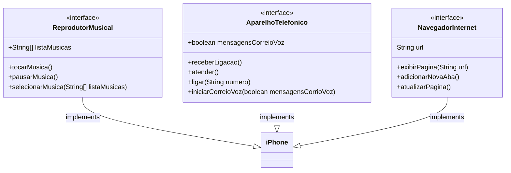

# Desafio Poo

Este é um repositório dedicado à realização do desafio proposto em [***DIO - Trilha Java Básico > Desafio POO***](https://github.com/digitalinnovationone/trilha-java-basico/tree/main/desafios/poo), relacionado à Programação Orientada a Objetos.

Abaixo é possível conferir o diagrama em UML feito a partir do Mermaid, que visa estabelecer uma lógica para a programação de um arquivo .java referente às funcionalidades requisitadas.

